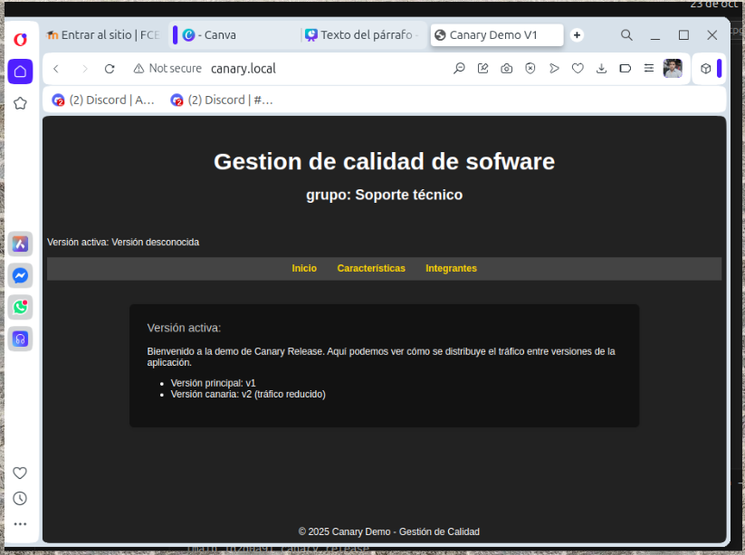
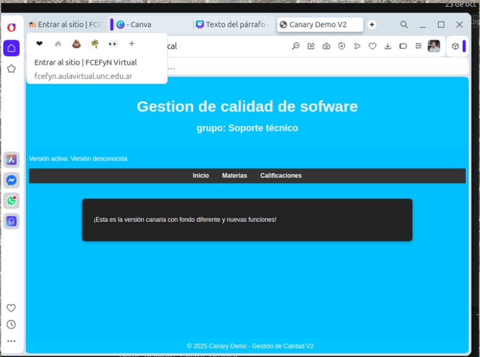
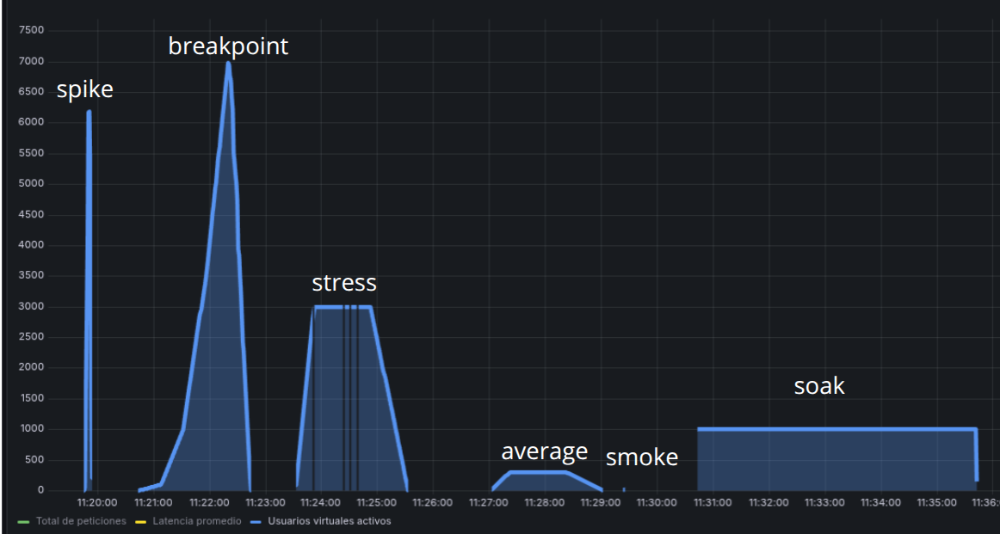

# 🚀 Despliegue de Minikube y Actualización de Imágenes Canary

## 🧩 1. Actualizar los repositorios

```bash
sudo apt-get update
```

---

## 🏗️ 2. Instalar Minikube

```bash
curl -LO https://storage.googleapis.com/minikube/releases/latest/minikube-linux-amd64
sudo install minikube-linux-amd64 /usr/local/bin/minikube
```

---

## ⚙️ 3. Instalar kubectl (binario oficial)

```bash
curl -LO "https://dl.k8s.io/release/$(curl -L -s https://dl.k8s.io/release/stable.txt)/bin/linux/amd64/kubectl"
chmod +x kubectl
sudo mv kubectl /usr/local/bin/
```

---

## 🌀 4. Iniciar Minikube

```bash
minikube start
```

---

## 🔍 5. Verificar el estado del clúster

```bash
kubectl get nodes
```

---

## 🌐 6. Habilitar el Ingress Controller (Nginx)

```bash
minikube addons enable ingress
```

---

## 🧱 7. Construir nuevas imágenes Docker

```bash
docker build --no-cache -t dariocastillo11/canary-demo:v1.8 .
docker build --no-cache -t dariocastillo11/canary-demo:v2.8 .
```

---

## ☁️ 8. Subir las imágenes a Docker Hub

```bash
docker push dariocastillo11/canary-demo:v1.8
docker push dariocastillo11/canary-demo:v2.8
```

---

## 🔄 9. Actualizar las versiones en los deployments

```bash
kubectl set image deployment/app-v1 nginx=dariocastillo11/canary-demo:v1.8
kubectl set image deployment/app-v2 nginx=dariocastillo11/canary-demo:v2.8
```

---

## ♻️ 10. Reiniciar los deployments

```bash
kubectl rollout restart deployment/app-v1
kubectl rollout restart deployment/app-v2
```

---

 verificar el estado con:

```bash
kubectl get pods -o wide
kubectl get svc
```


```bash
http://canary.local
```
# prueba:

---

---


# k6
## instalo en mi sistema:
```bash
sudo apt update
sudo apt install k6
```
--- 
## levanto servidor de influx para levantar emtricas
```bash
docker run -d --name=influxdb -p 8086:8086 influxdb:1.8
```
--- 
## levanto servidor de grafana
```bash
docker run -d --name=grafana -p 3000:3000 grafana/grafana

```
---
## saco la ip de influx que me servira para conectar grafana con influx
```bash
docker inspect -f '{{range .NetworkSettings.Networks}}{{.IPAddress}}{{end}}' influxdb

```
---
## corro scrip de js para analizar k6
```bash
k6 run --out influxdb=http://172.17.0.2:8086 canary-test.js

```
## resultados :
